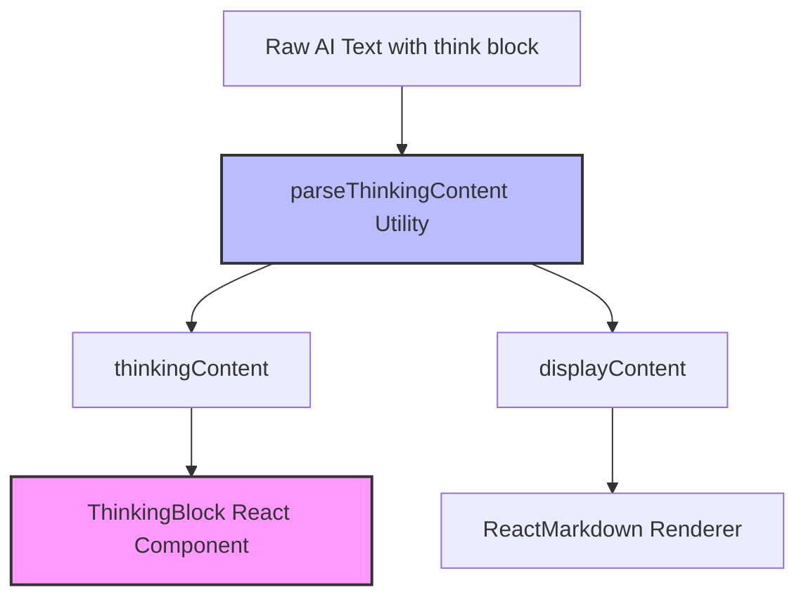

# 会议最终结论思维链渲染与重构说明书 (Final Conclusion Think Block Render Spec)

## 1. 问题与架构背景
大模型输出的 `<think>...</think>` 块是模型推理思考的产物。在当前系统中，最终结论直接使用 `ReactMarkdown` 渲染，导致 `<think>` 标签以非标准 HTML 显现，页面杂乱。
按照第一性原理和系统架构设计标准，我们需要杜绝 ad-hoc（即时/零散）式的代码编写。不同界面位置的思维链提取、解析、以及展示样式应具备**概念一致性（Conceptual Consistency）**，共享**单一事实来源（Single Source of Truth）**。

因此，我们将提取思维链的“数据解析逻辑”与“交互表现组件”进行全面解耦和重构，建立项目通用的思维链提取渲染标准。

## 2. 架构重构设计



### 2.1 统一的思维链数据解析器 (Data Utility)
在 `src/lib/content-parser.ts` 中暴露通用的 `parseThinkingContent` 函数，消除在多处手写正则表达式的混乱。

### 2.2 统一的思维链展示组件 (UI Component)
在 `src/components/ThinkingBlock.tsx` 中创建共享组件，封装与专家智能体交互逻辑完全一致的折叠动画、颜色、边距和样式。

---

## 3. 具体修改方案

### 3.1 增加数据解析器
文件路径：[content-parser.ts](file:///Users/jinhefeng/Dev/design-council-ai/src/lib/content-parser.ts)
新增函数：
```typescript
/**
 * 统一的思维链与正文内容提取工具
 */
export function parseThinkingContent(rawText: string): {
  thinkingContent: string;
  displayContent: string;
  isThinkingDone: boolean;
} {
  const text = rawText || "";
  let displayContent = text;
  let thinkingContent = "";
  let isThinkingDone = false;

  const thinkMatch = text.match(/<think>([\s\S]*?)(?:<\/think>|$)/i);
  if (thinkMatch) {
    thinkingContent = thinkMatch[1].trim();
    isThinkingDone = text.toLowerCase().includes("</think>");
    displayContent = text.replace(thinkMatch[0], "").trim();
  } else {
    isThinkingDone = true;
  }

  return { thinkingContent, displayContent, isThinkingDone };
}
```

### 3.2 增加公共展示组件
[NEW] 文件路径：[ThinkingBlock.tsx](file:///Users/jinhefeng/Dev/design-council-ai/src/components/ThinkingBlock.tsx)
代码实现：
```typescript
import React from "react";

interface ThinkingBlockProps {
  thinkingContent: string;
  isThinkingDone?: boolean;
  textAlign?: "left" | "right";
  style?: React.CSSProperties;
}

export const ThinkingBlock: React.FC<ThinkingBlockProps> = ({
  thinkingContent,
  isThinkingDone = true,
  textAlign = "left",
  style = {}
}) => {
  if (!thinkingContent || !isThinkingDone) return null;

  return (
    <details style={{ flex: 1, textAlign, marginBottom: "12px", ...style }}>
      <summary style={{ 
        fontSize: "11px", color: "var(--muted)", cursor: "pointer", userSelect: "none", 
        fontWeight: "500", display: "inline-block",
        background: "var(--surface-strong)", padding: "2px 8px", borderRadius: "999px",
        border: "1px solid var(--line)", outline: "none"
      }}>
        深度思考已折叠
      </summary>
      <div style={{ 
        fontSize: "13px", color: "var(--muted)", whiteSpace: "pre-wrap", 
        fontStyle: "italic", marginTop: "8px", padding: "10px 14px", 
        background: "rgba(0,0,0,0.02)", border: "1px dashed var(--line)", 
        borderRadius: "6px", textAlign: "left", lineHeight: 1.6
      }}>
        {thinkingContent}
      </div>
    </details>
  );
};
```

### 3.3 重构聊天气泡渲染
文件路径：[ChatMessageCard.tsx](file:///Users/jinhefeng/Dev/design-council-ai/src/components/ChatMessageCard.tsx)
- 移除组件内部 ad-hoc 正则提取逻辑。
- 引入 `parseThinkingContent` 和 `ThinkingBlock` 组件。
- 原有的 `<details>...</details>` 渲染替换为 `<ThinkingBlock thinkingContent={thinkingContent} isThinkingDone={isThinkingDone} textAlign={isUser ? "right" : "left"} />`。

### 3.4 改造最终结论渲染
文件路径：[page.tsx](file:///Users/jinhefeng/Dev/design-council-ai/src/app/page.tsx)
- 引入 `parseThinkingContent` 和 `ThinkingBlock` 组件。
- 对 `activeMeeting.finalConclusion` 进行解析，并在 ReactMarkdown 上方渲染统一的 `<ThinkingBlock thinkingContent={thinkingContent} isThinkingDone={isThinkingDone} />`。

---

## 4. 影响分析
- **高度向后兼容**：
  `finalConclusion` 依然完整保存原始的 AI 生成内容（含 `<think>` 标签）。编辑结论时展示包含 `<think>` 的全貌，保存后继续触发前端自动折叠，完全不损害数据流动。
- **高复用性**：
  统一了整个系统的思考过程展示逻辑，实现了专家消息气泡与结论面板交互的无缝一致。
