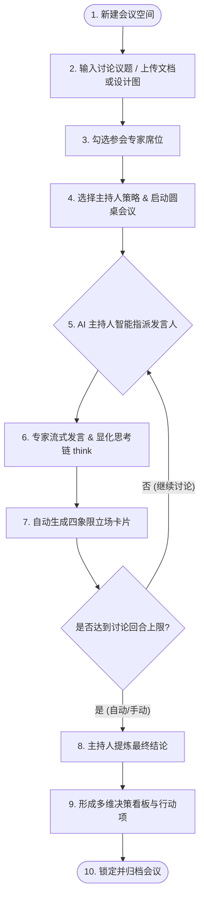

# Expert Council 智能体圆桌会议中心使用说明书 🚀

欢迎使用 **Expert Council AI**！这是一个专为本地运行设计的 **AI 专家圆桌讨论与决策评审平台**。
通过模拟真实世界中多领域专家的多轮辩论，它能帮助你从用户体验（UX）、系统架构、安全防护、商业可行性等多个维度对产品设计与技术方案进行全方位评估，并最终由 AI 主持人出具结构化的共识与行动指南。

本说明书专为**零基础的小白用户**设计，只需按照步骤操作，即可轻松上手！

---

## 🗺️ 核心工作流一览

在正式开始前，你可以通过下方图表快速了解一场 AI 圆桌会议是如何运转的：



---

## 1. 快速上手：小白第一步 ⏱️

你不需要掌握任何编程或代码配置知识，只需以下两步即可完成启动与全部初始化配置。

### 1.1 服务启动方法
系统支持两种启动模式，您可以根据部署环境自主选择：

#### ⚙️ 开发调试模式 (Local Dev)
1. 打开终端（Terminal）或控制台，进入项目根目录。
2. 运行启动命令：
   ```bash
   npm run dev
   ```
3. 在浏览器中打开：[http://localhost:3000](http://localhost:3000)。当您看到主站界面时，说明服务已成功启动！

#### 🚀 生产级后台守护部署 (Production PM2)
为了在真实生产环境中实现后台持久化运行、自动进程守护、崩溃自愈和日志分割，系统已预置了生产级 PM2 配置文件 [ecosystem.config.js](file:///Users/jinhefeng/Dev/design-council-ai/ecosystem.config.js)。部署步骤如下：
1. **安装 PM2 工具**（如果本地或服务器尚未安装）：
   ```bash
   npm install -g pm2
   ```
2. **打包构建 Next.js 生产版本**：
   ```bash
   pnpm build   # 或 npm run build
   ```
3. **使用 PM2 一键启动生产服务守护**：
   ```bash
   pm2 start ecosystem.config.js
   ```
   *(注：本配置采用 fork 模式单实例运行，这保障了 WebSocket 中继网关在内存中保存的外部智能体连接句柄能够精准对应，防范负载均衡多进程间通信串线。)*
4. **PM2 常用运维管理命令**：
   * 查看服务列表及状态：`pm2 list` 或 `pm2 status`
   * 查看实时日志输出：`pm2 logs`
   * 停止运行中的服务：`pm2 stop expert-council-ai`
   * 重新拉起/重启服务：`pm2 restart expert-council-ai`

### 1.2 系统初始化大模型配置
系统在第一次运行时由于没有连接任何大模型，会发出警告。你可以直接在网页上进行配置：
1. 点击首页右上角的 **“后台管理 →”** 按钮。
2. 进入后台页面后，找到 **“组织大模型配置”** 区域，点击 **“+ 新建配置”** 按钮。
3. 在弹出的窗口中填入你的大模型参数（以通义千问 API 为例）：
   - **配置名称**：给它起个好记的名字（如 `通义千问-Max`）。
   - **API 地址 (Endpoint)**：填入厂商的接口地址。
   - **模型名称 (Model ID)**：填入官方模型名称（如 `qwen-max`）。
   - **API Key**：填入你在大模型官网申请的专属 API 密钥。
4. 点击 **“保存配置”**。
5. 在保存好的模型配置卡片上，点击 **“设为默认”**。
6. 点击后台顶部或侧边的“返回主页”或返回浏览器上一页。

恭喜你！至此系统初始化已全部完成，所有的 AI 专家都将调用你刚才配置的底层引擎进行智能辩论。

---

## 2. 首页功能保姆级指南 💻

首页是进行圆桌会议的核心场所。界面主要分为：**最左侧会议空间**、**左侧专家席位**、**中间主讨论区**。

### 2.1 会议空间管理（最左侧侧边栏）
侧边栏用于管理你的所有讨论历史。
- **新建会议**：点击侧边栏顶部的 `+` 按钮，输入会议名称和简要的背景描述，即可开辟一个新的会议空间。
- **切换会议**：点击列表中的不同会议卡片，可在多场讨论间无缝切换。
- **已归档会议**：
  - 一旦会议出具了最终结论，该会议卡片会自动呈现为半透明的“已归档”状态，并在列表中**置底排列**，避免干扰你当前的活跃工作。
  - 归档会议的讨论区输入框将被自动锁定，防止意外修改。
  - **如何解锁？**：若需要重新讨论，只需在讨论区底部的“最终结论”面板中点击 **“解除锁定”** 按钮。该解锁状态会同步记录到你浏览器的 `localStorage` 中，即使刷新页面也不会重新锁定。

### 2.2 专家席位配置（左侧面板）
这里是你挑选智囊团的地方。为了满足不同层级的定制需求，系统将专家划分为**全局专家**与**会议级专家**：
- **全局专家 (Global Experts)**：
  - **定义**：由系统出厂内置，或由管理员在 **“后台管理”** 页面的“专家智能体管理”板块创建的专家。
  - **特点**：全系统共享，会在**所有会议**的专家席位列表中展现，供任何会议随时勾选调遣。
- **会议级专家 (Meeting-level Experts)**：
  - **定义**：直接在首页的“专家席位”面板右上角点击 `+` 按钮创建的自定义专家。
  - **特点**：它会自动绑定当前的会议 ID，**仅在当前会议中可见和生效**。切换到其他会议时，该临时专家会自动隐藏。这适合针对特定保密议题或临时探讨而量身定制的专家，避免污染全局专家列表。
- **参会置顶与调整**：
  - 勾选专家头像旁的复选框，该专家就会被邀请加入本场会议。
  - **所有已勾选的参会专家会自动置顶**，未被勾选的闲置专家会自动沉底，方便确认参会阵容。
  - 在每个专家卡片下方，你可以拉动滑动条调整其**“辩论强度” (Lvl 1 - 5)**，强度越高，AI 发言时的对抗性、挑刺和论证力度就越激烈。
  - 如果选择“点名发言（手动）”模式，你还可以对专家点击 **“点名发言 👉”**，强制该专家在当前轮次首先发言。

### 2.3 发起讨论与配置（主讨论区底部）
在会议尚未启动前，你需要在底部的控制区设定本次会议的讨论内容：
1. **输入议题**：在巨大的输入框中，详细写下你要讨论的问题。
   > 💡 **小白贴士**：问题越具体，AI 专家的辩论就越有深度。例如：“*我们计划将产品原生的常规表单改为向导式步骤条，这会如何影响用户的转化率和开发工时？*”
2. **上传附件 (可选)**：
   - 支持直接拖拽或点击上传产品需求文档（PDF, Word, Markdown）或 UI 设计草图（JPG, PNG）。
   - 系统会在**本地浏览器安全解析**这些文件，并转化为纯文本提取物作为客观背景信息投喂给专家，绝不泄露你的隐私。
3. **选择主持人策略**：
   - **温和折中**（默认）：主持人倾向于平息争论，寻求各方利益的最大公约数。
   - **激进创新**：主持人鼓励冲突与前沿尝试，更偏向采纳突破常规的先锋方案。
   - **严格推进**：主持人高度关注开发工时、落地可行性与项目风险控制。
4. **启动会议**：点击 **“开始讨论”**。

### 2.4 会议进行中与阅读技巧（讨论区中部）
点击开始后，AI 智能体将全面接管会议，并自动流式输出：
- **连线指示器**：讨论区会展现淡金色的导向线，标明当前是哪位专家正在发言，以及下一个被指派的专家是谁。
- **查看思考过程 (`<think>` 标签)**：
  对于拥有“长考”能力的推理模型（如 DeepSeek-R1），其深思熟虑的逻辑会被包裹在消息气泡顶部的 **“查看思考过程”** 折叠框中。点击即可展开，查看 AI 是如何纠结和自我审视的。
- **四象限立场卡片**：
  每位专家发言完毕后，消息气泡下方都会附带一张清晰直观的结构化四象限卡片：
  - 🟩 **Stance (立场)**：支持、反对、中立还是有所保留？
  - 🟥 **Concern (风险)**：从该专家的专业视角看，存在哪些隐患？
  - 🟨 **Recommendation (建议)**：具体的落地方案或修改意见是什么？
  - 🟦 **Tradeoff (取舍)**：为了实现该方案，必须牺牲或妥协什么？

### 2.5 提炼最终结论与人工编辑
- **提炼时机**：当专家们讨论了多轮，或者你觉得观点已经足够丰富时，可以随时点击底部的 **“提炼结论 / 更新结论”** 按钮。点击后，页面会自动平滑滚动沉底，定位到正在提炼的流式加载区。你随时可以点击 **“取消提炼”** 打断并补充讨论。
- **阅读决策看板**：
  主持人提炼的最终结论采用“人类多维权衡决策看板”设计，清晰罗列了**共识总结**、**潜在盲区**、以及**具体的行动项 (Action Items)**。
- **总结后的编辑订正（人机协同）**：
  如果对 AI 主持人总结的内容觉得不完全满意或需要补充，你可以点击结论面板右上角的 **“编辑”** 按钮（带有铅笔小图标）。此时面板会一键切换为可编辑的文本输入框。你可以直接在此处手动修改、优化或扩写最终的决议结果。修改完毕后，点击 **“保存结论”** 即可，点击 **“取消”** 放弃本次修改。

### 2.6 导出会议记录
当会议中产生讨论记录时，主讨论区右上角会自动出现一个 **“导出”** 图标按钮（带有向下箭头的托盘图标）：
1. 点击该按钮，系统会自动抓取当前会议的所有对话内容（包括发言专家的名称、头衔、时间、思考过程、四象限立场卡片等）。
2. 将其完美打包下载为一个独立的 `.html` 格式离线网页文件。
3. 导出的 HTML 文件保留了应用原生的自适应暗色玻璃排版样式，你可以直接在任何设备的浏览器中离线双击打开、打印成 PDF 或在团队内部传阅。
4. 导出的 HTML 中会自动隐去右上角操作按钮及顶部的“真枪实弹配置警告条”等调试元素，保证交付报告的高端与整洁。

---

## 3. 后台管理系统指南 ⚙️

点击首页顶部导航栏的 **“后台管理”** 链接，即可进入大本营。后台管理是为组织管理员或希望深度定制 AI 工作流的“高阶小白”准备的。

### 3.1 全站配置导入与导出（页面顶部）
- **导出系统配置**：点击该按钮，系统会将你当前所有的“大模型配置、提示词模板、大模型运行参数、自定义专家”一键打包为一段加密的 JSON 文本并复制到你的剪贴板。你可以将其粘贴保存到记事本中作为备份。
- **导入系统配置**：当你需要把配置迁移到另一台电脑或恢复备份时，点击此按钮，粘贴导出的 JSON 文本，点击确认，系统将合并并覆盖现有配置，自动刷新后即可无缝恢复。

### 3.2 人类用户属性设置
- 在这里填入你的**称呼**（如“小张”）与**头衔**（如“主美 / Lead Artist”）。
- 配置完成后，点击“保存配置”。你在首页发布问题时，提问气泡上方就会优雅地显示你的头衔，增加会议的沉浸式体验。

### 3.3 组织大模型配置 (LLM Engines)
系统支持自由添加和编辑各种 API 接口作为底层推理引擎：
- **默认激活**：你可以创建多个引擎配置，点击配置卡片上的“设为默认”将其设为激活状态。
- **新建配置表单**：
  - **配置名称**：给它起一个好记的名字（如 `通义千问-Max` 或 `DeepSeek-推理`）。
  - **API 地址 (Endpoint)**：服务商提供的接口基准 URL。
  - **模型名称 (Model ID)**：如 `qwen-max` 或 `deepseek-reasoner`。
  - **API Key**：你的专属授权令牌。
- **单引擎操作**：每项配置卡片均提供“编辑”、“删除”、“复制配置到剪贴板”和“导入单模型”功能，极大方便单点迁移。

### 3.4 全局工作流提示词配置（🌟 系统的灵魂）
后台展示了圆桌会议生命周期的 11 个核心节点的系统提示词（System Prompt）模板：
- **状态比对角标**：
  - 🟢 **出厂默认配置**：说明该提示词处于系统最鲁棒的初始状态。
  - 🟡 **已自定义修改**：说明该提示词已被你修改并保存。
- **一键恢复**：如果你改乱了，别慌！每个提示词右上角都有一个 `[恢复默认]` 链接；或者你可以滑到最下方点击 **“重置系统工作流提示词”** 大按钮，一键还原出厂设置。

> [!WARNING]
> **占位符安全红线**：
> 提示词模板中包含诸如 `{expertName}`、`{previousTurns}`、`{lens}`、`{question}` 等用花括号包裹的占位符。这些是系统运行时动态填入数据的变量，**请千万不要修改或删除花括号及里面的英文字符**，否则会导致系统在分配发言或渲染卡片时崩溃！

### 3.5 全局专家管理 (系统专家与自定义专家)
- 后台的“系统专家与组织自定义专家管理”列表中罗列了所有的全局专家。
- 你可以点击“编辑”直接修改系统内置专家的视角、性格以及具体的 Prompt，这被称为“内置专家覆盖(Override)”。
- 如果对其修改不满意，点击 **“恢复出厂”** 即可一键抹除自定义 override 记录，恢复出厂预设。
- 点击右上角的 `+ 新建配置` 创建的专家，由于它不在具体会议的上下文内，会自动保存为“全局自定义专家”，可以在所有会议室的左侧面板被看到并选用。

---

## 4. 外部智能体（小龙虾）接入专区 🦐

除了使用系统内置的大模型扮演专家，你还可以把**外部自行开发、带有专有数据库或有状态的独立智能体角色**（在本项目中亲切地称为“小龙虾 Bot”）接入圆桌会议，让它们参与讨论。

### 4.1 为什么要接入外部智能体？
内置专家是通过单一的全局大模型提示词“扮演”出来的。而外部智能体可以拥有：
1. **专属知识库 (RAG)**：例如一个挂载了你们公司全部 API 文档的“技术专家”。
2. **私有调用逻辑**：它能自己调取外部工具（Tool Calling）进行查阅后，再到圆桌上发言。
3. **完全独立的模型**：它可以使用完全不同于主会场的物理模型。

### 4.2 CLP 接入协议与可视化配置步骤
系统基于 **CLP (Council Link Protocol)** 协议与外部智能体建立长连接。在 CLP 拓扑中，**本平台作为 WebSocket 服务端（默认监听在 18788 端口）**，外部智能体客户端（如 QwenPaw 或独立的 Python 进程）主动发起连接并进行握手鉴权。

可视化配置接入的步骤如下：

1. **在平台侧生成并分配 Token**：
   - 在主页“专家席位”或后台管理中，点击新建或编辑专家。
   - 将弹窗顶部的 **“接入外部智能体”** 滑动开关拨至右侧。
   - 平台将自动生成此专家的专属 **`Bot Token`**。点击 **“复制”** 按钮将其保存，待后续配置到外部客户端中。随后点击下方 **“保存智能体”**。

2. **在外部客户端配置本平台的连接地址 (Platform Gateway URL)**：
   在您本地或服务器运行的外部智能体配置文件（如 QwenPaw 插件的 `settings.json` 或独立 Python 进程参数）中，填入上述复制的 `Bot Token`，并配置本平台网关的 WebSocket 监听地址。根据您的物理部署网络，地址配置规范如下：
   - **本地单机开发调试 (Local Dev)**：若本平台与外部 Bot 运行在同一台电脑，连接地址填写：
     ```text
     ws://localhost:18788/bot  （或 ws://127.0.0.1:18788/bot）
     ```
   - **局域网跨机器部署 (Intranet)**：若本平台部署在公司局域网某台独立服务器上，连接地址中的 `localhost` 需替换为该服务器的内网 IP。例如：
     ```text
     ws://192.168.1.100:18788/bot
     ```
     *⚠️ 注意：请确保平台所在服务器的防火墙已放行 `18788` 端口，且两端机器网络互通。*
   - **云端公网生产部署 (Production Cloud)**：若平台部署在公网云服务器上，为了防止鉴权 Token 和通信内容在公网明文传输被窃听，**强烈建议配置域名并使用 Nginx 进行 SSL 反向代理**，使用加密的 `wss` 协议连接。例如：
     ```text
     wss://your-domain.com/bot
     ```

3. **测试连通性**：
   - 启动您本地/服务器上的外部智能体程序。
   - 外部客户端连通平台后，在平台的专家弹窗中点击 **“测试连接”** 按钮。
     - 🟢 **在线 (绿色呼吸灯)**：说明握手成功，Bot 已在平台网关注册排队，您可以随时在主页勾选并派它发言。
     - 🔴 **离线 (红色指示灯)**：说明网络不可达或 Token 不匹配，请检查外部客户端是否已成功启动，并核实客户端配置的 `botToken` 与 `serverUrl` 是否正确无空格。

### 4.3 频道插件安装包与一键安装方法 (QwenPaw / Copaw)
为了协助你本地运行的外部智能体（以 QwenPaw/AgentScope 系统为例）与平台无缝建立长连接，我们为您准备了专用的 CLP 频道扩展插件安装包和配套的安装脚本。

#### 📥 统一安装包下载：
*   💾 **【频道适配器安装包一键下载】**：[qwenpaw-adapter-agentcouncil.zip](file:///Users/jinhefeng/Dev/design-council-ai/public/qwenpaw-adapter-agentcouncil.zip) （若在网页中阅读，可直接点击：[/qwenpaw-adapter-agentcouncil.zip](/qwenpaw-adapter-agentcouncil.zip)）—— 包含下方所有核心组件，解压即可运行。

#### 📦 插件包内核心文件清单（可点击本地链接查看）：
*   📄 **【一键安装脚本】**：[install.sh](file:///Users/jinhefeng/Dev/design-council-ai/packages/qwenpaw-adapter-agentcouncil/install.sh) —— 自动注册插件到个人目录中。
*   📄 **【一键卸载脚本】**：[uninstall.sh](file:///Users/jinhefeng/Dev/design-council-ai/packages/qwenpaw-adapter-agentcouncil/uninstall.sh) —— 清理并删除已注册的频道插件。
*   📄 **【频道逻辑主体】**：[agent_council_channel.py](file:///Users/jinhefeng/Dev/design-council-ai/packages/qwenpaw-adapter-agentcouncil/agent_council_channel.py) —— 实现 CLP 协议流式传输的核心组件。
*   📄 **【包初始化引导】**：[__init__.py](file:///Users/jinhefeng/Dev/design-council-ai/packages/qwenpaw-adapter-agentcouncil/__init__.py) —— 频道模块注册器。
*   📄 **【独立运行适配器】**：[adapter.py](file:///Users/jinhefeng/Dev/design-council-ai/packages/qwenpaw-adapter-agentcouncil/adapter.py) —— 轻量化免环境依赖的 Agent 客户端运行脚本。

---

#### 🛠️ 方式一：作为 QwenPaw / Copaw 桌面版原生频道加载 (推荐)
如果您本地安装了 **QwenPaw Desktop** 桌面客户端或常规命令行版，其配置与扩展目录存储在个人用户目录下（`~/.copaw` 或 `~/.qwenpaw`）。

1. **执行一键注册**：
   打开终端并切换到本工程根目录，运行以下命令：
   ```bash
   bash packages/qwenpaw-adapter-agentcouncil/install.sh
   ```
   该脚本会自动将 `__init__.py` 与 `agent_council_channel.py` 注册到您的 QwenPaw 插件拓展文件夹（如 `~/.copaw/custom_channels/agent_council`）中。
2. **在客户端中配置连接参数**：
   打开您的 `settings.json` 配置文件，在 `channels` 段下配置我们新增的 `agent_council` 频道，并开启：
   ```json
   {
     "channels": {
       "agent_council": {
         "enabled": true,
         "serverUrl": "ws://localhost:18788/bot",
         "botToken": "从前台专家弹窗中复制得到的专属_TOKEN"
       }
     }
   }
   ```
3. **重新加载/重启 QwenPaw**，长连接建立后，前台对应的外部专家卡片即可亮起 **🟢 在线** 指示灯。

---

#### 🛠️ 方式二：使用独立适配器脚本运行 (轻量快捷，适合开发者调试)
如果您仅想使用单个 Python 进程承载特定的模型或 Mock 会话，可以使用独立的适配器脚本运行，无需配置完整的客户端环境：

1. **安装网络及智能体库依赖**：
   ```bash
   pip install websockets agentscope
   ```
2. **运行独立适配器**：
   在终端运行以下命令（传入您的 Bot Token 和平台网关的 WebSocket 监听地址）：
   ```bash
   python packages/qwenpaw-adapter-agentcouncil/adapter.py 您的_BOT_TOKEN ws://localhost:18788/bot
   ```
   连接建立后，终端输出 `[QwenPaw-Adapter] WebSocket 连接建立成功！`。当平台会议需要该专家发言时，本地脚本将自动被调起，流式且实时地回传评审意见。

---

## 5. 常见问题排查与 FAQ ❓

### Q1：为什么专家发言时，消息气泡尾部会有残留的空行灰色框？
**答**：这是因为某些外部大模型在输出结尾自带了未闭合的 ```json 代码块标记。系统已在最新版的 `content-parser.ts` 引擎中引入了“双向吞并算法”，会自动将未闭合的代码标记连同 JSON 数据块一并吸收清洗。如果仍然出现，请尝试在后台的大模型配置中将该引擎的 `Temperature` 参数适当调低（例如设为 0.5），使输出更加稳定。

### Q2：为什么专家发言突然中断，且没有生成底部的四象限卡片？
**答**：这通常是因为大模型单次生成的长度限制（Max Tokens）被耗尽，或者推理模型“想得太多”（思考链太长）导致正文被截断。
- **解决方法一**：在后台管理页面中，将“大模型运行参数配置”里的 `max_tokens`（最大生成限制）调大（如调至 4096 或 8192）。
- **解决方法二**：在首页发起讨论时，适当减少一次性勾选的参会专家数量（推荐每次 3~4 名专家最适宜），防止上下文过长导致模型疲劳。

### Q3：为什么已归档的会议，在刷新页面后又重新被锁定了？
**答**：系统在新版本中已对此体验进行了深度优化。只要你在结论面板点击了“解除锁定”，该状态就会立即被写进浏览器的 localStorage。请确认你的浏览器没有开启“无痕模式”或设置了“退出时自动清除网站数据”，否则浏览器将无法在本地为您保留解锁状态。

### Q4：为什么外部专家（小龙虾）发言后，主持人提炼结论时会一直卡在 "thinking" 状态？
**答**：这通常是因为外部专家返回的数据格式被污染，导致上下文历史中夹杂了非标格式，使主持人在总结时解析 JSON 失败而卡死。
- **系统防护**：本系统已经针对此边缘情况做好了兜底。当解析失败时，会自动丢弃格式错误的 JSON，平滑降级为全文本输出，杜绝前端页面卡死。
- **排查建议**：请联系外部智能体的开发者，确保其在 stream 发言结束的 done 报文中，返回符合 CLP 协议规范的 `expertStance` 字典字段。

---

祝你使用愉快！如果遇到任何问题，欢迎随时联系系统管理员或在后台“导出配置”备份数据后，点击“重置系统工作流提示词”重新开始。🎉
