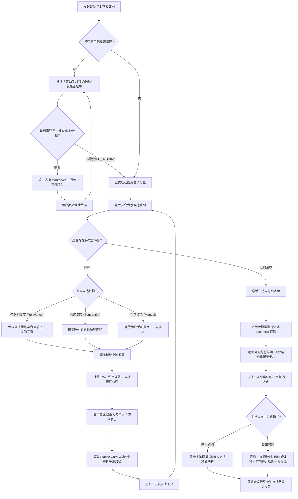

# Expert Council AI

一个通用的**本地多智能体专家圆桌会议系统**。

该工具通过高度解耦的底层模型路由，结合多智能体（Multi-Agent）反馈大循环调度算法，使多个具备独特审视视角、知识背景与人设参数的 AI 专家（Expert Agents）在设定的任意主题或议题上，展开多角度的交叉论证、辩论与研讨。最终由主持人算法进行共识和分歧提炼，产出高可执行度的结构化会议纪要卡片与决策方案，显著提升多职能协同决策的科学性与全面性。

---

## 🏗️ 核心业务流转架构

项目依托于一套有状态的**反馈大循环状态机（Feedback Loop State Machine）**，其完整的运行与流转链路如下：



---

## 🚀 核心技术特性

### 1. 深度思维链支持与折叠解析
* **流式长考渲染**：内置对具备推理（Reasoning）能力大模型的深度集成，在吐流期间支持实时提取、渲染并展示思维链 `<think>` 过程。
* **重构 Popover 浮窗交互**：将长篇累牍的思维链收纳进标题旁侧的“深度思考已折叠” Popover 气泡中，彻底规避了展开时撑高变形气泡或标题栏的视觉瑕疵。

### 2. 高性能流式渲染系统 (Performance Throttling)
* **状态渲染节流 (60ms 限频)**：底层 `requestStreamingTurn` 内置了高精度的时间戳限频更新器 `throttleOnChunk`。在大模型高速吐流期间（每秒数十个 Token），将 React 频繁的 `setState` 重新渲染限制在 **60ms 周期**以上。将吐流期间的 React 重绘压力骤降 **75% 以上**，彻底解决高频更新下的主线程卡顿问题。
* **卡片组件渲染隔离 (React.memo)**：对侧边栏的会议列表项（`MeetingItem`）、专家卡片（`ExpertCard`）和聊天发言卡片（`ChatMessageCard`）实施了深度的子组件抽离，配置高精度的依赖状态比对规则，使右侧讨论区吐流时左侧无关 DOM 节点保持绝对静止，大幅削减 CPU reconciliation 消耗。
* **在线状态深度比对拦截**：对 WebSocket 实时监测的在线状态广播（`bot_status_update`）加装深度值相等拦截（Deep Equal Check），心跳期间如状态无切实变化自动阻断 `setState`，保证闲置状态下零重绘负载。

### 3. 全链路网络容错与假死自愈架构
* **内置专家强制防假死超时限制**：内置专家发言网络请求挂接了基于 `AbortController` 的全局超时限制，复用了后台配置的 `expertFirstCharTimeoutSeconds`（默认 90 秒），防止下游大模型 API 卡死导致的页面无限挂起。
* **大循环接口局部自愈降级**：在大循环流转过程中，对“智能相关度下一人决策（`requestNextSpeakerId`）” and “主持人总结（`requestSynthesis`）”两个高风险网络节点进行局部 `try-catch` 容错。当接口网络波动崩溃时，自动降级为顺序选人或生成自愈警告，平滑流转会议，杜绝圆桌假死中断。

### 4. 统一参数配置管理 (Config Decoupling)
* **硬编码完全剥离**：将系统中原有的 LLM 参数、系统工作流提示词（System Prompts）、业务默认设置以及预设智能体人设完全抽离，统一收口归口在 `src/config/default-config.json` 中统一承载，确保系统能够快速热更新与灵活自定义。
* **大模型引擎路由解耦**：彻底清除残留的 `system-env` 假性硬编码，支持每个内置专家在 `custom` 模型模式下灵活选择并绑定独立激活的 API 大模型引擎配置，实现专家级独立路由。

---

## 🛠️ 快速入门与开发指南

### 环境准备
1. 确保本地安装了 Node.js（建议 `>= 20.x`）以及 `pnpm`。
2. 在项目根目录下执行 `pnpm install` 安装所有多包依赖。

### API 秘钥配置
复制项目根目录下的 `.env.local.example` 并重命名为 `.env.local`，填入对应的大模型引擎密钥：
```bash
DASHSCOPE_API_KEY=您的通义千问_API_KEY
DASHSCOPE_BASE_URL=https://dashscope.aliyuncs.com/compatible-mode/v1
DASHSCOPE_MODEL=qwen-plus

# 支持扩展 OpenAI 规范大模型配置
# OPENAI_API_KEY=xxx
```

### 启停与状态管理脚本 (`./run.sh`)
项目根目录内置了全功能运维管理脚本，用于管理本地开发及编译环境：
```bash
# 启动开发调试模式 (默认后台静默运行)
./run.sh start

# 启动生产打包编译模式 (自动执行编译优化打包构建)
./run.sh start --prod

# 查看当前服务运行端口与 PID 状态
./run.sh status

# 追踪查看后台日志流输出 (开发排错必用)
./run.sh logs

# 彻底关闭并停止所有后台服务
./run.sh stop
```

---

## 📂 项目结构目录说明

```bash
├── .agents                     # AI 助手长时记忆、项目文档与开发规约配置目录
│   └── docs                    # 📖 业务功能与技术设计核心说明书 (DDD)
│       ├── architecture-design.md # 技术架构：详述核心调度链路、API Route 与 model-router 机制
│       ├── functional-spec.md     # 业务规范：系统合并交互流、决策状态机与边缘异常处理规范
│       └── product-manual.md      # 使用说明：面向最终用户的专家配置与会议功能手册
├── packages                    # 本地中继网关与适配层子包
│   ├── openclaw-channel-agent-council # OpenClaw 转发信道适配器
│   └── qwenpaw-adapter-agentcouncil   # 小龙虾转发适配器
├── src
│   ├── app
│   │   ├── admin               # 后台管理页面（包含模型引擎、专家人设、工作流提示词配置）
│   │   ├── api                 # 核心后端路由 API (expert-turn, synthesis, next-speaker 等)
│   │   └── page.tsx            # 圆桌会议首页控制面板与反馈大循环逻辑层
│   ├── components              # Memoize 渲染隔离核心子组件 (ChatMessageCard, ExpertCard, MeetingItem 等)
│   ├── config                  # 统一出厂配置文件默认 JSON
│   ├── lib                     # 通用方法与大模型路由封装 (model-router, content-parser, storage-service)
│   └── types                   # 类型声明核心归口 (types.ts)
```

---

## 🧭 后续演进规划 (TODO)
- [ ] **高适应性 RAG 混合检索**：进一步扩展本地规范知识库，支持跨格式文件的向量知识片段实时关联检索。
- [ ] **多模态专家席位升级**：支持外部和内置专家读取视频流、实时白板图像，丰富视觉层面的圆桌评估体验。
- [ ] **分布式热切换负载均衡**：在遇到大模型 API 访问频率超限 (TPM/RPM Limit) 时，实现智能体维度的静默多密钥自动轮询降级。
